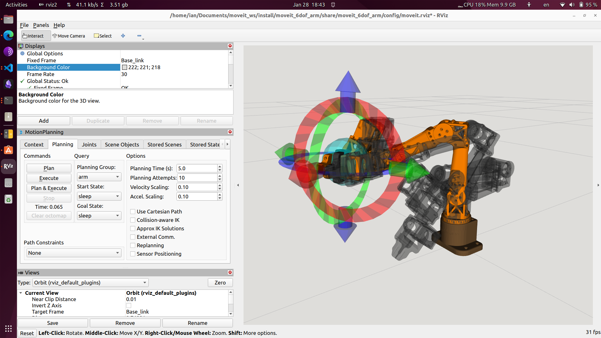
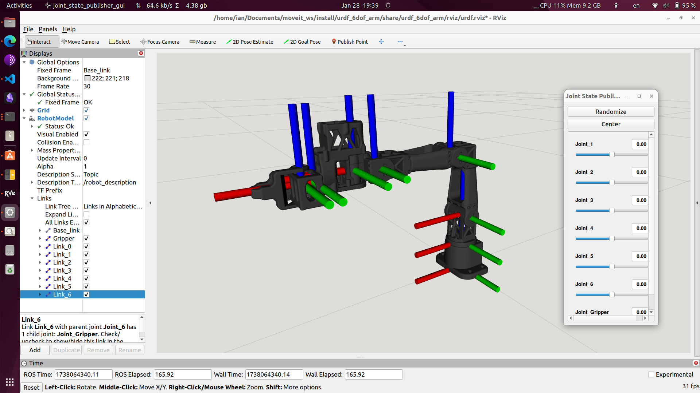

# 6DOF Arm Configuration

This repository contains the configuration files for a 6DOF robotic arm, including URDF, SDF, and launch files for simulation and visualization in ROS2.

## Installation

1. Clone the repository into your ROS2 workspace:
    ```bash
    cd ~/your_ros2_ws/src
    git clone <repository_url>
    ```

2. Build the workspace:
    ```bash
    cd ~/your_ros2_ws
    colcon build
    ```

3. Source the workspace:
    ```bash
    source ~/your_ros2_ws/install/setup.bash
    ```

## Usage

### MoveIt! Demo

To run the MoveIt! demo:
```bash
ros2 launch moveit_6dof_arm demo.launch.py
```



### Display in RViz

To display the robot model in RViz:
```bash
ros2 launch urdf_6dof_arm display.launch.py
```



